# 자연어 처리

자연어
- 사람이 자연스럽게 사용하는 언어
형식 언어
- 규칙이 명확하게 정해져 있는 언어

### 기계 번역의 진화

1세대 : 규칙 기반 시대
2세대 : 통계 기반 시대
3세대 : 딥러닝 시대
4세대 : 트랜스포머 시대

실습 내용
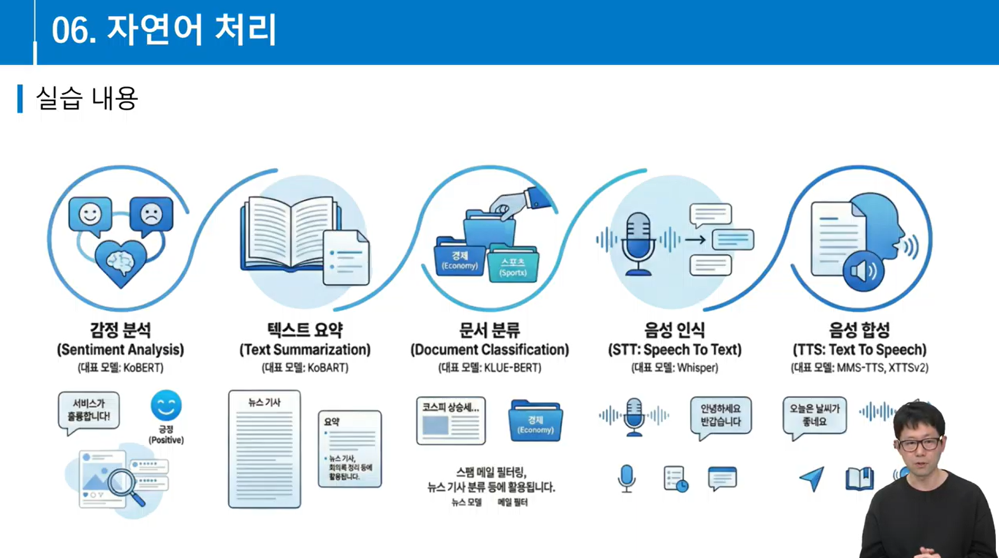

### Sentiment Analysis

- 비즈니스
- 고객 서비스
- 소셜 미디어
- 헬스 케어
- 공공 서비스

<관련기술>
규칙 기반 : 단어 사전, 패턴 매칭
기계학습 : SVM, Naive Bayes, TF-IDF
딥러닝 : RNN, LSTM, Transformer(BERT, KoBERT)

### BERT
- Transformer 아키텍처에서 Encoder 부분
- ALBERT, RoBERTa, ELECTRA등 발전
- 실습에서는 KoBERT 활용

### GPT
- OPEN AI
- Transformer 아키텍처에서 Decoder 부분
- Text Generation에 활용

### Bidirectional Encoder Representations from Transformers

진정한 문맥 이해는 단방향이 아닌 '양방향(Bidirectional)'에서 온다
학습방식(Masked Language Model - MLM)
- 문장의 마지막 단어를 예측하는 대신, 중간에 임의의 단어를 가림([MASK])
- 가려진 단어를 예측하기 위해, 문장의 왼쪽과 오른쪽을 모두 참고하도록 강제
- 이 과정에서 모델은단어 간의 깊은 관계와 문맥을 학습

### BERT / GPT

## KoBERT
- SKT에서 개발한 한국어 BERT 모델
    - BERT (multilingual) 모델도 한국어를 다루지만 한국어 특성의 정확도가 떨어지는 한계 존재
- 한국어 이해도가 높음
- 한국어 Wikipedia + 뉴스 포함 한국어 데이터 활용
    - 대략 500문장 이상
- 한국어 특화 SentencePiece 기반 토크나이저
- PyTorch, Tensorflow 지원

### Tokenization

### 한글 Tokenization
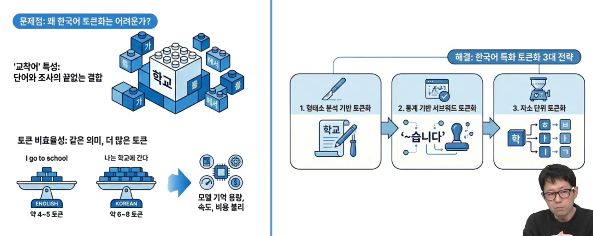

### SentencePiece
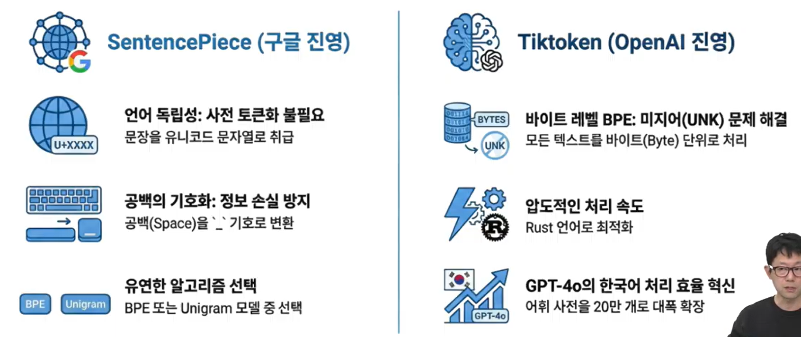

### Sentiment-analysis-fine-tuned-model
- KoBERT 파인튜닝
- AI 허브 한국어 감정 데이터셋 튜닝
- 긍정, 부정, 중립 등의 감정 레이블

### KcBERT
- 구어체 전문 AI

### HuggingFace Transformers
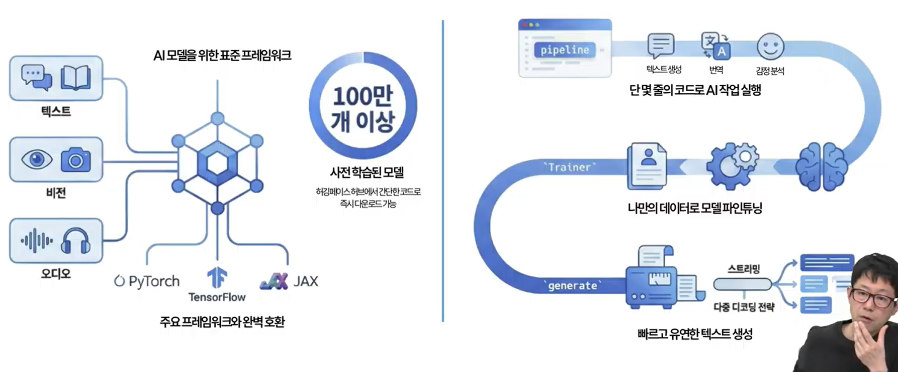

### Text Summarization
- 텍스트에서 핵심 정보와 개념을 추출하거나 재작성하여 간결한 요약문을 생성

### Bidirectional and Auto-Regressive Transformers
- BART는 양방향 Transformer Encoder와 자기회귀(Autoregressive) 디코더를 결합한 Seq2Seq 모델 (BERT식 이해, GPT식 생성)
- Facebook에서 개발되었으며 실습에서는 한국어 데이터로 사전학습 된 KoBART를 활용

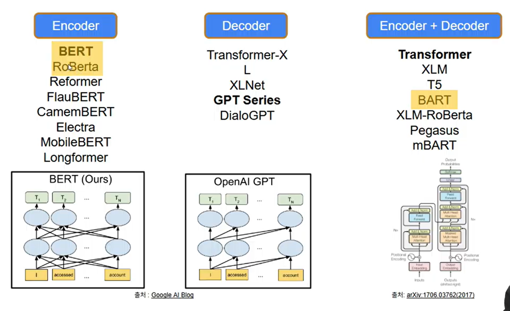

### HuggingFace Transformers pipeline 함수
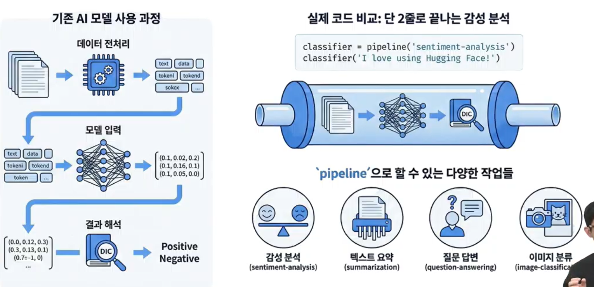

### 실습 : KoBART Summarization Fine-Tuning
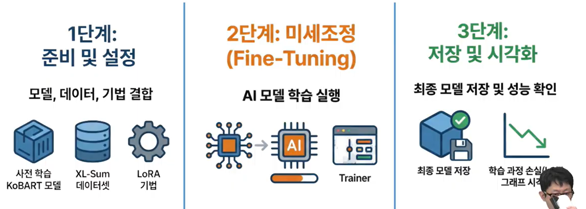

### XL-Sum 데이터셋
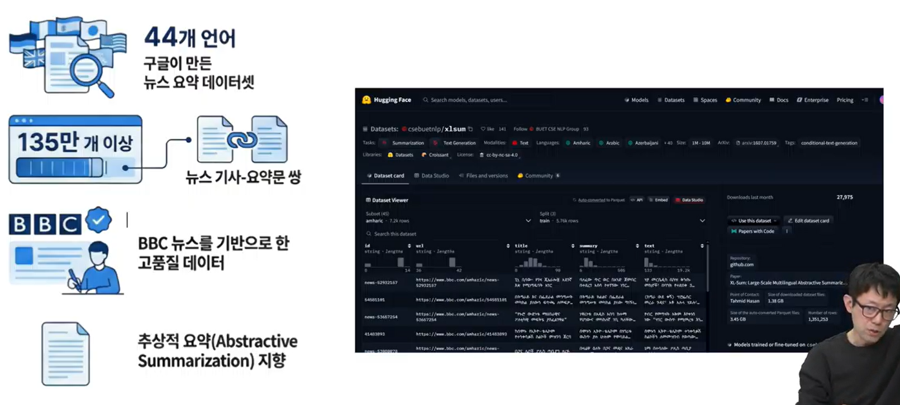

### 사용되는 주요 전처리 기법
- 텍스트 정제
- 시퀀스 길이 정규화
- 토큰화 및 인코딩
- 전이 학습
- LoRA 미세 조정
- Seq2Seq 학습

### Transfer Learning
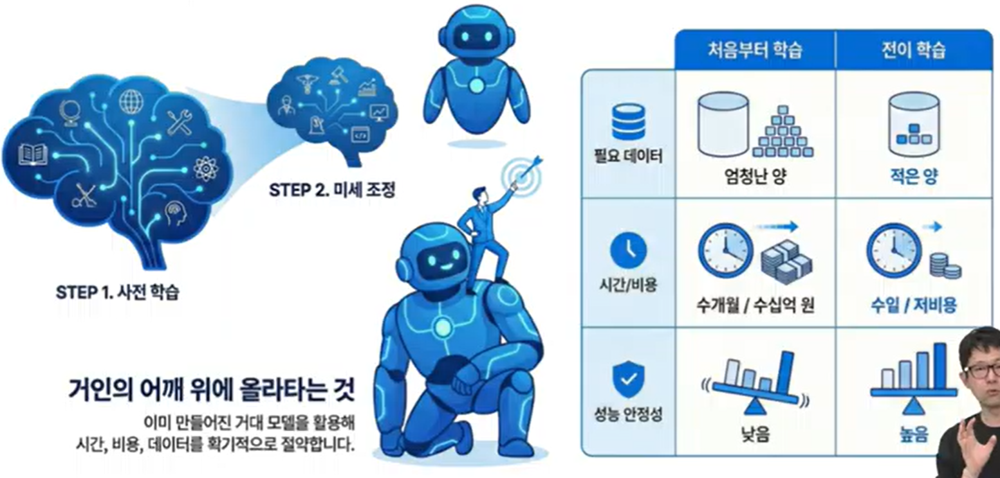

### 학습 하이퍼파라미터
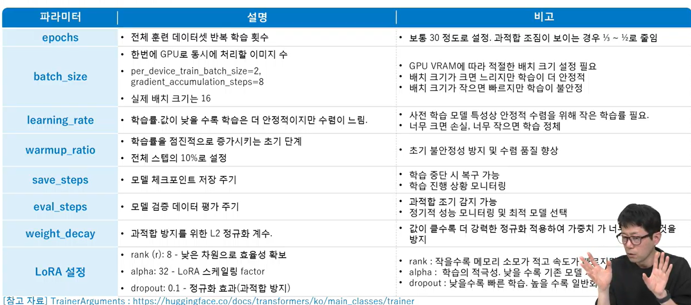

### Robustly optimized BERT approach
- BERT가 아직 잠재된 성능을 최대한 끌어내지 못했다고 판단
- BERT 업그레이드판

### RoBERTa
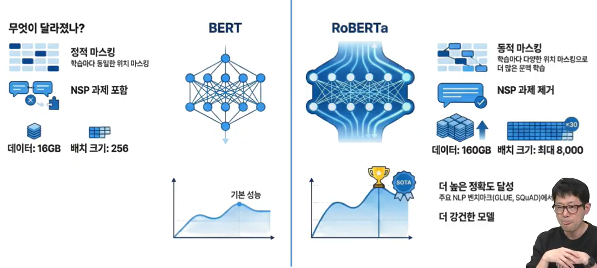

### 실습 : 문서 분류(Document Classification)
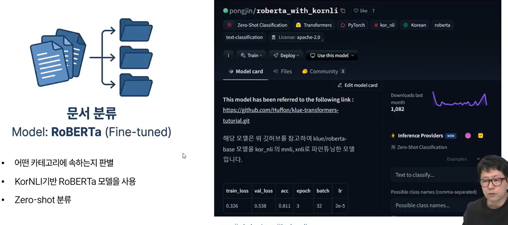

### KorNLI
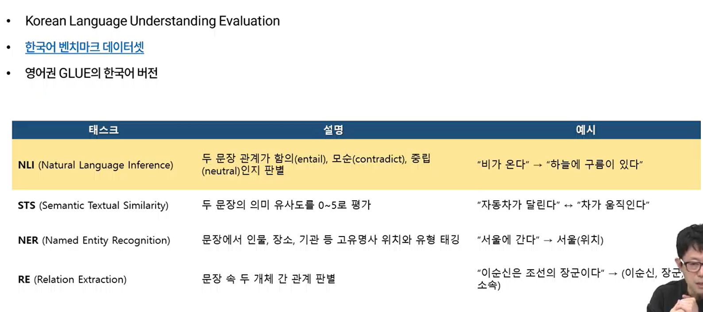

### Zero-Shot Classfication
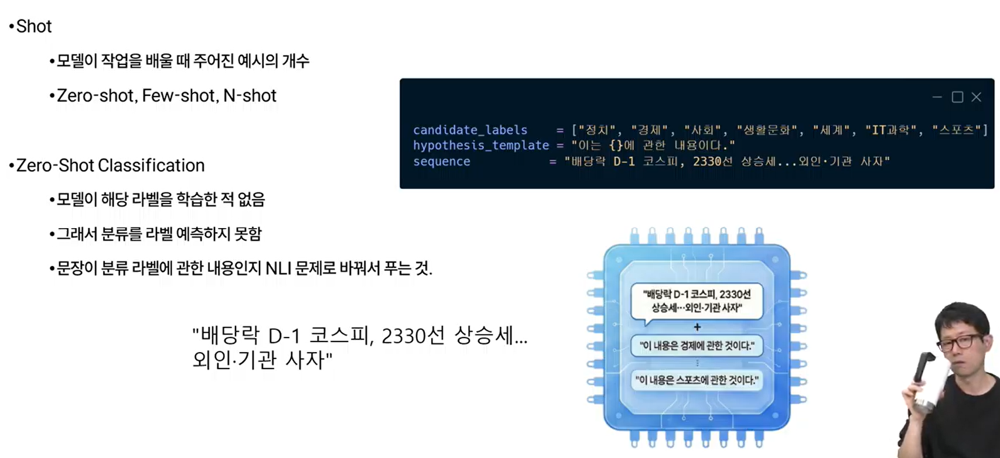

### 실습 : Text-Classfication Fine-Tuning
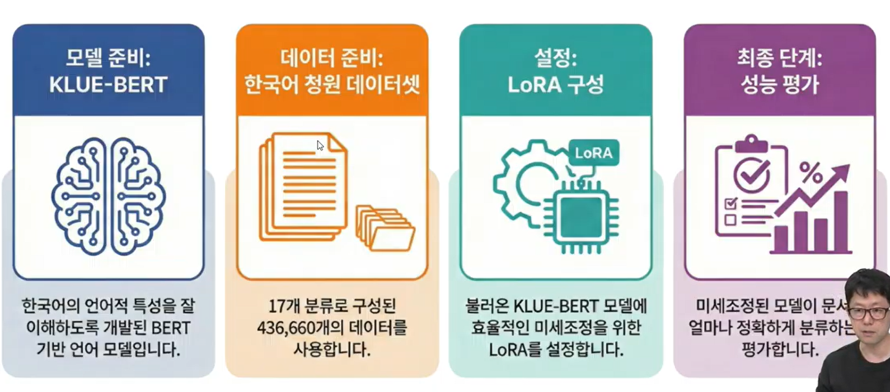

### 사용되는 주요 후처리 기법
softmax 확률 계산
신뢰도 점수
레이블 매핑

### 사용되는 주요 성능 평가 기법
정확도
정밀도
재현율
F1 점수

### OpenAI Whisper
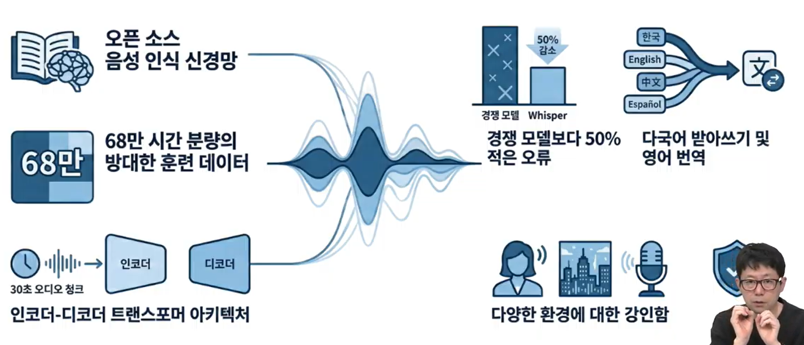