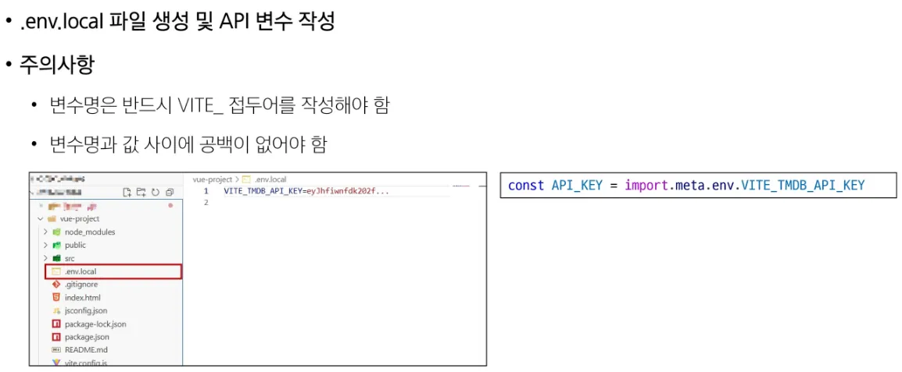

# 📌 Vue + Django 인증 구현(TIL)
### ✨ 오늘 배운 핵심 주제
- Django: `dj-rest-auth`를 활용한 인증 API 구축 및 Custom User Model 적용
- Vue: Pinia를 이용한 Token 상태 관리 및 유지 (persist)
- Flow: 회원가입 $\rightarrow$ 자동 로그인 $\rightarrow$ 메인 페이지 이동
- Security: Vue Router Navigation Guard를 통한 접근 제어
- Optimization: 환경 변수(.env) 관리 및 Axios 헤더 설정

---

## 1️⃣ 프로젝트 준비
### ✔ Django 설치
```bash
pip install django
pip install djangorestframework
pip install dj-rest-auth
pip install django-allauth
pip install django-cors-headers
```

## 2️⃣ Django Setting.py 필수 설정
### ✔ INSTALLED_APPS 등록

```python
INSTALLED_APPS = [
    # ...기본 앱들
    'rest_framework',
    'rest_framework.authtoken', # Token 인증 필수
    'dj_rest_auth',
    'dj_rest_auth.registration',
    'allauth',
    'allauth.account',
    'allauth.socialaccount',
    'corsheaders', # CORS
    'accounts',    # 내 앱
]

SITE_ID = 1

# 미들웨어 최상단에 추가
MIDDLEWARE = [
    'corsheaders.middleware.CorsMiddleware',
    # ...
]

# CORS 허용 (개발 단계)
CORS_ALLOW_ALL_ORIGINS = True

# 인증 클래스 설정 (Token 방식)
REST_FRAMEWORK = {
    'DEFAULT_AUTHENTICATION_CLASSES': [
        'rest_framework.authentication.TokenAuthentication',
    ],
}

# 커스텀 유저 모델 지정
AUTH_USER_MODEL = 'accounts.User'

# 커스텀 회원가입 Serializer 연결
REST_AUTH_REGISTER_SERIALIZERS = {
    'REGISTER_SERIALIZER': 'accounts.serializers.CustomRegisterSerializer',
}
```

## 3️⃣ Django URL 설정
### 👉 crud/urls.py
```python
from django.contrib import admin
from django.urls import path, include

urlpatterns = [
    path('admin/', admin.site.urls),
    path('accounts/', include('dj_rest_auth.urls')),
    path('accounts/registration/', include('dj_rest_auth.registration.urls')),
    path('api/v1/posts/', include('posts.urls')),  
]
```
## 4️⃣ Custom User Model
기본 User 모델에 없는 필드(예: nickname)를 추가하기 위해 커스터마이징을 수행한다.
### 👉 accounts/models.py
```python
from django.contrib.auth.models import AbstractUser
from django.db import models

class User(AbstractUser):
    nickname = models.CharField(max_length=50, null=True, blank=True)
    # 필요한 필드 추가 (age, profile_image 등)
```

## 5️⃣ Custom RegisterSerializer
dj-rest-auth의 기본 회원가입 로직에 닉네임 저장을 추가한다.
### 👉 accounts/serializers.py

```python
from dj_rest_auth.registration.serializers import RegisterSerializer
from rest_framework import serializers

class CustomRegisterSerializer(RegisterSerializer):
    nickname = serializers.CharField()

    def get_cleaned_data(self):
        data = super().get_cleaned_data()
        data['nickname'] = self.validated_data.get('nickname', '')
        return data
```

### 👉 settings.py에 적용

```python
REST_AUTH_REGISTER_SERIALIZERS = {
    'REGISTER_SERIALIZER': 'accounts.serializers.CustomRegisterSerializer',
}
```

---

## 6️⃣ Vue 프로젝트 준비
```bash
npm create vue@latest
npm install axios
npm install vue-router
npm install pinia pinia-plugin-persistedstate
```
### 🍍 Pinia Store (stores/userStore.js)
토큰 관리와 인증 요청을 담당하는 중앙 저장소. persist: true로 새로고침 시에도 로그인이 유지되도록 한다.
```js
import { defineStore } from "pinia"
import { ref, computed } from "vue"
import axios from "axios"

export const useUserStore = defineStore("user", () => {
  const token = ref(null)
  
  // 토큰이 있으면 로그인 상태로 간주
  const isLogin = computed(() => token.value !== null)

  const BASE_URL = import.meta.env.VITE_API_URL

  // 회원가입
  const signup = async (payload) => {
    // dj-rest-auth 회원가입 엔드포인트
    const res = await axios.post(`${BASE_URL}/accounts/registration/`, payload)
    return res
  }

  // 로그인
  const login = async (payload) => {
    const res = await axios.post(`${BASE_URL}/accounts/login/`, payload)
    // 서버로부터 받은 key(토큰) 저장
    token.value = res.data.key
  }

  // 로그아웃
  const logout = () => {
    token.value = null
    // 필요 시 백엔드 로그아웃 API 호출 추가 가능
  }

  return { token, isLogin, login, logout, signup, BASE_URL }
}, { persist: true })
```

## 4️⃣ Vue Views Implementation
### 📝 회원가입 (views/RegisterView.vue)
회원가입 성공 시 즉시 로그인 처리 후 메인으로 이동시켜 UX를 개선한다.

```js
<template>
  <main>
    <h1>회원가입</h1>
    <form @submit.prevent="onSubmit">
      <input v-model="username" placeholder="아이디" />
      <input type="password" v-model="password" placeholder="비밀번호" />
      <input type="password" v-model="passwordConfirm" placeholder="비밀번호 확인" />
      <input v-model="nickname" placeholder="닉네임" />
      <button>가입하기</button>
    </form>
  </main>
</template>

<script setup>
import { ref } from "vue"
import { useUserStore } from "@/stores/userStore"
import { useRouter } from "vue-router"

const username = ref("")
const password = ref("")
const passwordConfirm = ref("") // 변수명 명확하게
const nickname = ref("")

const store = useUserStore()
const router = useRouter()

const onSubmit = async () => {
  const payload = {
    username: username.value,
    password: password.value,           // Back: password 필드 필수
    password_confirmation: passwordConfirm.value, // Back: 확인 필드
    nickname: nickname.value,
  }

  try {
    // 1. 회원가입 요청
    await store.signup(payload)
    
    // 2. 자동 로그인 처리 (UX 개선)
    await store.login({ username: username.value, password: password.value })
    
    // 3. 메인 이동
    router.push({ name: 'Main' }) 
  } catch (err) {
    console.error(err)
    alert("회원가입 실패")
  }
}
</script>
```
### 🔐 로그인 (views/LoginView.vue)

```js
<template>
  <main>
    <h1>로그인</h1>
    <form @submit.prevent="onSubmit">
      <input v-model="username" placeholder="아이디" />
      <input type="password" v-model="password" placeholder="비밀번호" />
      <button>로그인</button>
    </form>
  </main>
</template>

<script setup>
import { ref } from "vue"
import { useUserStore } from "@/stores/userStore"
import { useRouter } from "vue-router"

const username = ref("")
const password = ref("")
const store = useUserStore()
const router = useRouter()

const onSubmit = async () => {
  try {
    await store.login({ username: username.value, password: password.value })
    router.push({ name: 'Main' })
  } catch (err) {
    alert("로그인 정보를 확인해주세요.")
  }
}
</script>
```

## 🔟 Token이 필요한 요청 예시
### 👉 게시글 목록 조회

```js
axios.get(`${store.BASE_URL}/api/v1/posts/`, {
  headers: { Authorization: `Token ${store.token}` }
})
```

### 👉 게시글 생성
```js
axios.post(`${store.BASE_URL}/api/v1/posts/`, data, {
  headers: { Authorization: `Token ${store.token}` }
})
```

## 1️⃣1️⃣ Vue Router 인증 가드
### 👉 router/index.js
```js
router.beforeEach((to, from) => {
  const store = useUserStore()

  if (to.meta.loginRequired && !store.isLogin) {
    return "/login"
  }

  if (to.meta.preventWhenLoggedIn && store.isLogin) {
    return "/"
  }
})
```
## 1️⃣2️⃣ 로그아웃
### 👉 NavBar.vue
```js
<button v-if="user.isLogin" @click="logout">로그아웃</button>

<script setup>
import { useUserStore } from "@/stores/userStore"
import { useRouter } from "vue-router"

const user = useUserStore()
const router = useRouter()

const logout = () => {
  user.logout()
  router.push("/login")
}
</script>
```

## 1️⃣3️⃣ 환경 변수

### .env.local
```ini
VITE_TMDB_API_KEY=``
```
### 사용
```js
const API_KEY = import.meta.env.VITE_TMDB_API_KEY
```

## 1️⃣4️⃣ 참고 공식 문서
| 주제                    | 링크                                                                                                   |
| --------------------- | ---------------------------------------------------------------------------------------------------- |
| Django REST framework | [https://www.django-rest-framework.org/](https://www.django-rest-framework.org/)                     |
| dj-rest-auth          | [https://dj-rest-auth.readthedocs.io/en/latest/](https://dj-rest-auth.readthedocs.io/en/latest/)     |
| Django allauth        | [https://django-allauth.readthedocs.io/en/latest/](https://django-allauth.readthedocs.io/en/latest/) |
| Vue                   | [https://vuejs.org/](https://vuejs.org/)                                                             |
| Pinia                 | [https://pinia.vuejs.org/](https://pinia.vuejs.org/)                                                 |
| Axios                 | [https://axios-http.com/](https://axios-http.com/)                                                   |

---
## 🌟 마무리 (내가 느낀 점)

- Vue와 Django 인증은 개념적으로 어렵지만 흐름을 알고 나면 반복적인 패턴이 많다.
- 특히 Token 저장, Pinia 상태 관리, Router 가드가 핵심이며
- Django 측에서는 serializer 커스터마이징이 중요하다.
- 오늘 배운 흐름만 잘 기억하면 프로덕션 서비스에서도 사용할 수준의 인증 시스템을 만들 수 있다!